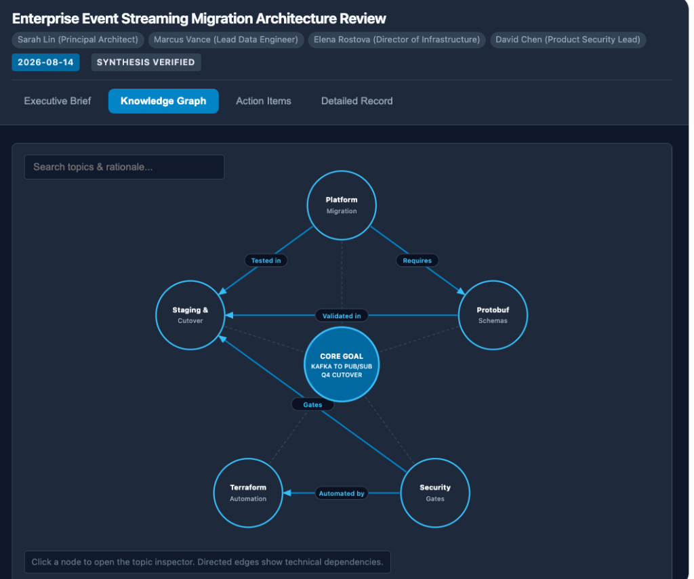
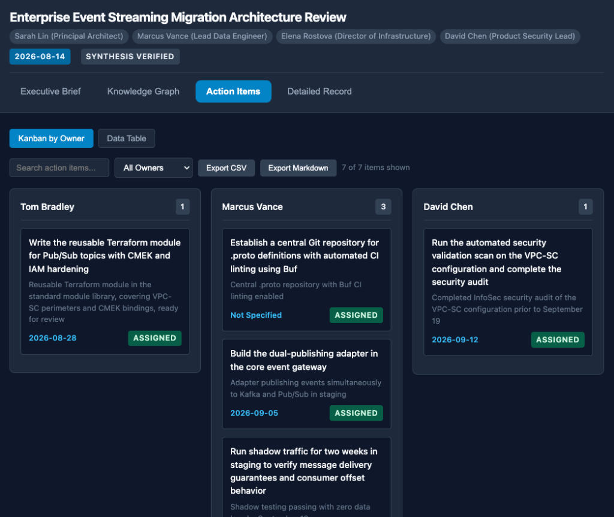

# Meeting Transcript Summary Skill

A standardized agent skill for extracting high-fidelity, structured intelligence from raw meeting transcripts. Compatible with enterprise agent platforms, assistant environments, and standalone LLM agent harnesses.

---

## Overview

Most generic meeting summaries reduce discussions to high-level bullet points, losing the technical context, the debates, and the rationale behind critical decisions.

This skill enforces a rigorous, multi-tier analysis framework designed to satisfy different stakeholder requirements from a single transcript:

1. **Executive Summary:** High-level strategic briefing covering core objectives, major decisions, impact, and critical blockers stated by participants.
2. **Detailed Discussion Record and Action Items:** A comprehensive narrative record organized by topic. Captures the specific details of what was said by participants, statements made, and the "Why" (arguments exchanged, trade-offs evaluated, alternatives dismissed) without adding external explanations. Concludes with a four-column Action Items table.
3. **Five-Sentence Summary:** Exactly five dense, self-contained sentences providing a rapid briefing summarizing what was said in the meeting.
4. **Interactive Web Dashboard:** A self-contained visual interface featuring KPI metrics cards, an interactive SVG Topic Knowledge Graph with dependency edges and slide-out inspector, and a dynamic Kanban by Owner action items board.

The skill operates under strict quality standards: objective business tone, zero conversational filler, zero hallucination, zero external topic explanations, and strict factual grounding in what was said.


---

## Repository Structure

```text
meeting-transcript-summary-skill/
├── SKILL.md                          # Primary agent instruction file with YAML frontmatter
├── README.md                         # End-user documentation and integration guides
├── LICENSE                           # License file
├── assets/
│   ├── skill_workflow_diagram.png          # Architecture and workflow diagram
│   ├── dashboard_executive_brief.png       # Executive Brief screenshot
│   ├── dashboard_knowledge_graph.png       # Knowledge Graph screenshot
│   └── dashboard_action_items.png          # Action Items Kanban screenshot
├── templates/
│   └── meeting_dashboard_template.html     # Self-contained interactive dashboard template
├── references/
│   ├── dashboard_ui_guide.md               # Guide for interactive dashboard rendering and data schema
│   ├── transcript_formats.md               # Reference guide for caption and transcript formats
│   └── quality_checklist.md                # Audit rubric used to verify output quality
├── examples/
│   ├── sample_meeting_transcript.txt       # Sample meeting transcript (synthetic data only)
│   ├── sample_output_summary.md            # Expected three-tier gold standard output
│   └── sample_meeting_dashboard.html       # Working interactive dashboard example
└── scripts/
    └── clean_transcript.py                 # Standalone Python utility to strip caption timestamps
```

---

## Non-Technical User Guide: How to Use This Skill

Follow these three steps to generate a structured meeting summary.

### Step 1: Obtain the Meeting Transcript

Export or copy the transcript from your video conferencing platform or transcription tool (.vtt, .srt, or plain text .txt).

### Step 2: Provide the Transcript to Your Agent

You can either attach the transcript file directly to the chat or paste the transcript text into the prompt.

#### Sample Prompt 1: Using an Attached File
```text
Summarize the meeting transcript in the attached file using the meeting-transcript-summary skill.
```

#### Sample Prompt 2: Pasting Raw Text
```text
Apply the meeting-transcript-summary skill to the following transcript:

[Paste transcript here]
```

#### Sample Prompt 3: Specifying a File Path
```text
Please process the transcript located at examples/sample_meeting_transcript.txt and generate the three-tier summary.
```

#### Sample Prompt 4: Requesting Dual Output (Rendered + Raw Markdown)
```text
Summarize the attached meeting transcript using the meeting-transcript-summary skill. Provide dual output with both rendered markdown and a raw markdown code block.
```

#### Sample Prompt 5: Requesting an Interactive Web Dashboard
```text
Process the attached meeting transcript with the meeting-transcript-summary skill and generate an interactive dashboard with the topic knowledge graph and action items visualizer.
```

### Step 3: Review and Copy the Output

The agent will output the structured document consisting of:
- Metadata Header (Title, Date, Participants)
- Section 1: Executive Summary
- Section 2: Detailed Discussion Record with the Action Items table
- Section 3: Five-Sentence Summary

**Copying to Documents:**
- **To Rich Text Document Editors and Wikis:** Select and copy the rendered text directly from the chat window; formatting (bold headings, bullet lists, and tables) is preserved automatically.
- **To Markdown Editors / Code Repositories:** Use the "Copy" button on the raw markdown code block when dual or raw output mode is selected.

---

## Agent Platform Deployment and Integration

### 1. Workspace Skill Integration

To make this skill available across your agent workspaces:

1. Place the skill folder inside your custom skills directory:
   - For global agent configuration: Place the folder under your agent environment's skills directory.
   - For project-level configuration: Place `SKILL.md` inside `.agents/skills/meeting-transcript-summary/` within your project root.
2. In chat, prompt the agent:
   ```text
   Use the meeting-transcript-summary skill to analyze the transcript in path/to/transcript.txt
   ```

### 2. Enterprise Assistant Integration

To add and enable this skill in an enterprise assistant platform:

1. Open the agent settings or skills configuration interface.
2. Create a new skill named `meeting-transcript-summary`.
3. Provide the description:
   `Analyzes raw meeting transcripts from video conferencing exports, WebVTT, SRT, or plain text. Produces an Executive Summary, a Detailed Discussion Record preserving technical explanations and an Action Items table, and a 5-Sentence Summary.`
4. Upload or copy the full content of [SKILL.md](SKILL.md) into the skill instructions.
5. Optionally upload [references/transcript_formats.md](references/transcript_formats.md) and [references/quality_checklist.md](references/quality_checklist.md) as reference knowledge.

### 3. Project Knowledge Integration

1. In your project assistant environment, create a project for meeting analysis.
2. In the project knowledge repository, upload `SKILL.md`, `references/quality_checklist.md`, and `references/transcript_formats.md`.
3. In custom instructions, set:
   ```text
   When provided with a meeting transcript, always follow the procedures, formatting rules, and constraints defined in SKILL.md.
   ```

### 4. Command Line and Automated Pipelines

You can use the included Python preprocessor before passing transcripts to an API or local LLM:

```bash
# Clean raw WebVTT or SRT files into clean dialogue format
python3 scripts/clean_transcript.py raw_meeting.vtt --output cleaned_transcript.txt

# Pipe directly into a CLI agent harness
cat cleaned_transcript.txt | your-agent-cli --prompt "Execute meeting-transcript-summary"
```

---

## Detailed Output Specifications

### 1. Executive Summary
- **Meeting Objective:** 1 to 2 direct sentences defining the core purpose of the meeting.
- **Key Decisions Made:** Bullet points highlighting final agreements and approved strategies.
- **Strategic Outcomes & Impact:** Quantifiable benefits, architectural shifts, or organizational impacts.
- **Critical Risks & Blockers:** Unresolved technical, security, or resource risks.

### 2. Detailed Discussion Record and Action Items
- **Logical Topic Organization:** Groups dialogue by discussed subject rather than chronological chatter.
- **Details of What Was Said:** Captures specific statements, technical details, configurations, performance benchmarks, numbers, and constraints spoken by participants. Strictly avoids generating external explanations or general tutorials of the topics.
- **The "Why":** Documents the arguments, trade-offs, concerns, and reasons why alternatives were rejected as spoken by participants.
- **Action Items Table:** Four aligned columns:
  - `Action Item`: Descriptive, unambiguous task.
  - `Assigned To`: Direct owner name or `Unassigned` if not stated.
  - `Deadline`: Exact date, sprint milestone, or `Not Specified`.
  - `Acceptance Criteria / Target Deliverable`: Concrete artifact, review sign-off, or link required.

### 3. Five-Sentence Summary
- Exactly 5 full, grammatically distinct sentences summarizing what was said and decided.
- Captures purpose, core problem, primary decision, secondary outcome, and immediate next milestone.
- Zero bullet points, zero line breaks within the paragraph.

### Output Delivery Modes
- **Rendered Markdown (Default):** The summary is rendered natively in the agent harness UI. Selecting and copying text from the chat window pastes directly as rich text into document editors with tables and headings preserved.
- **Raw Markdown Code Block:** Wraps the entire document in a fenced code block with a one-click copy button, suitable for saving to `.md` files or Markdown editors.
- **Dual Output Mode:** Outputs both the visually rendered document and the raw Markdown code block in a single response.
- **Interactive Web Dashboard Mode:** Generates a self-contained HTML/CSS/JS dashboard emitted as a user-facing artifact named `dashboard.html` (`UserFacing: true`, `Summary: "Interactive Evaluation Dashboard"`, `RequestFeedback: false`), rendering directly in iframe preview runtimes without manual file copying.

---

## Interactive Web Dashboards

When invoked in environments supporting HTML webviews or interactive artifact runtimes, the skill can generate an interactive, self-contained dashboard:

### Core Visual Features:

#### 1. Executive Overview & KPI Cards
Instant metrics for key decisions, topics covered, assigned deliverables, and target cutover date, alongside structured cards for Meeting Objectives, Key Decisions, Strategic Impacts, and Critical Risks.


#### 2. Interactive Topic Knowledge Graph
A visual SVG node-link topology connecting the core meeting goal to discussed topics, labeled with concise short titles (e.g. `Platform Migration`, `Protobuf Schemas`). Features directed relationship edges between interdependent topics with workflow labels (e.g. `Enforces`, `Requires`, `Gates`). Clicking any node opens a slide-out Detail Inspector drawer presenting full context, in-depth technical mechanisms, decision rationale ("The Why"), and conclusions.



#### 3. Action Items Visualizer & Toolbar
- **Interactive Toolbar:** Includes an **Owner Dropdown Filter** (defaulting to `All Owners`), real-time search input, one-click CSV/Markdown export buttons, and a live items-shown count badge.
- **Kanban by Owner Board (Default):** Groups tasks into columns by assignee (plus an `Unassigned` backlog column) for rapid team resource planning.
- **Sortable Data Table:** Filterable, searchable table with instant data inspection and sorting.



#### 4. Narrative Discussion Accordions
Expandable topic blocks allowing stakeholders to inspect the complete unabridged meeting record.

#### 5. Light and Dark Mode Toggle
A button in the header displaying Sun / Moon SVG graphics, allowing instantaneous theme toggling with persisted preferences across sessions.

### Template & Reference:
- Reusable Template: [templates/meeting_dashboard_template.html](templates/meeting_dashboard_template.html)
- Working Example: [examples/sample_meeting_dashboard.html](examples/sample_meeting_dashboard.html)
- Architecture Guide: [references/dashboard_ui_guide.md](references/dashboard_ui_guide.md)

---

## Core Rules and Constraints

- **Pure Factual Grounding (Zero Hallucination, Zero Making Things Up):** Output must strictly contain only facts, decisions, numbers, and arguments directly stated in the source transcript. Never hallucinate, invent names, or fabricate data.
- **Strictly Record What Was Said (No External Explanations):** Document exclusively what participants articulated during the meeting. Do not provide external conceptual explanations, definitions, or tutorials on the topics discussed.
- **Absolute Tone:** Direct and factual prose. Eliminates filler phrases, polite acknowledgments, and motivational commentary.
- **Zero Extrapolation or Implication:** Never infer or assume anything not explicitly spoken during the meeting. If a detail, date, or owner is missing or unstated, mark it explicitly as `[Unassigned]` or `[Not Specified]`.
- **Clean Professional Formatting:** Structured using standard Markdown headings, organized bullet points, and aligned data tables.
- **Zero Conversational Framing:** The output starts directly with the title header and terminates immediately after the final sentence. No introductory greeting or follow-up offer.
- **Missing Input Handling:** If invoked without a transcript, the agent requests the input directly and terminates execution.

---

## Quality Audit

Before delivering a summary, the output is audited against [quality_checklist.md](references/quality_checklist.md). You can review a complete reference input and output pair in the `examples/` directory (note: all participant names, projects, metrics, and meeting dialogues in the sample files are synthetic data only):
- Input: [sample_meeting_transcript.txt](examples/sample_meeting_transcript.txt) (Synthetic Data)
- Output: [sample_output_summary.md](examples/sample_output_summary.md)
- Interactive Dashboard: [sample_meeting_dashboard.html](examples/sample_meeting_dashboard.html)

---

## License

This project is licensed under the Apache License, Version 2.0. See the [LICENSE](LICENSE) file for details.
