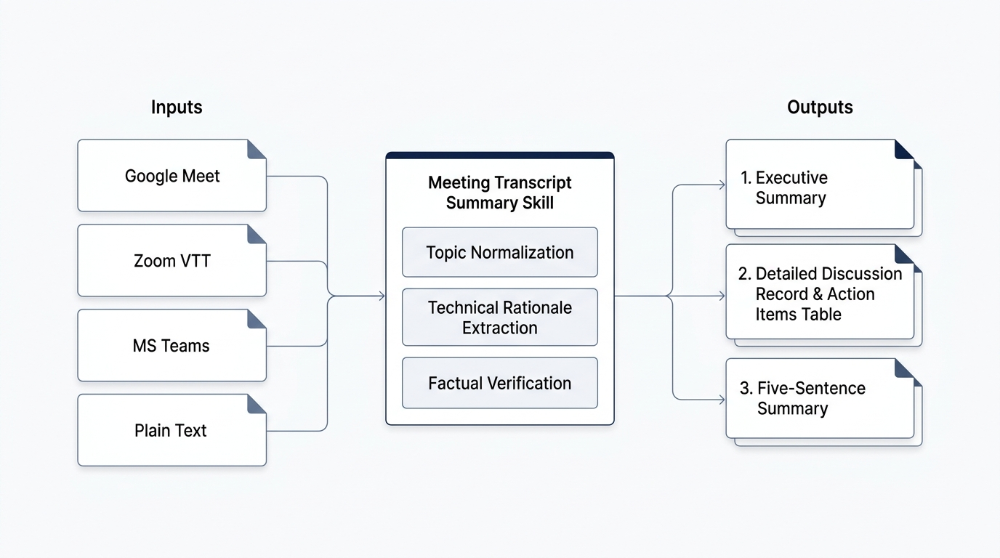
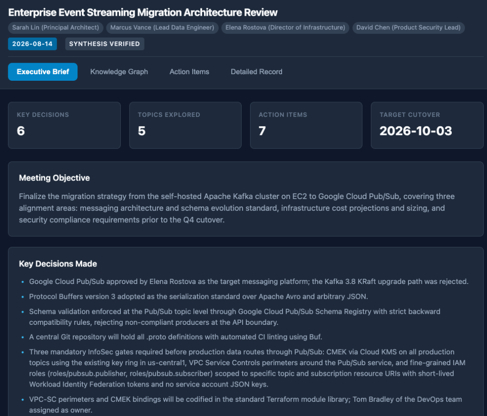

# Meeting Transcript Summary Skill

A standardized agent skill for extracting high-fidelity, structured intelligence from raw meeting transcripts. Compatible with Gemini Enterprise App, Google Antigravity, Claude Desktop/Projects, OpenAI Custom GPTs, and standalone agent harnesses.

---

## Overview

Most generic meeting summaries reduce discussions to high-level bullet points, losing the technical context, the debates, and the rationale behind critical decisions.

This skill enforces a rigorous, multi-tier analysis framework designed to satisfy different stakeholder requirements from a single transcript:

1. **Executive Summary:** High-level strategic briefing covering core objectives, major decisions, impact, and critical blockers for leadership.
2. **Detailed Discussion Record and Action Items:** A comprehensive narrative record organized by topic. Captures complete technical explanations, architecture details, and the "Why" (arguments exchanged, trade-offs evaluated, alternatives dismissed). Concludes with a four-column Action Items table.
3. **Five-Sentence Summary:** Exactly five dense, self-contained sentences providing a rapid briefing suitable for status reports or chat digests.
4. **Interactive Canvas UI Dashboard:** A self-contained visual interface featuring KPI metrics cards, an interactive SVG Topic Knowledge Graph with dependency edges and slide-out inspector, and a dynamic Kanban by Owner action items board.

The skill operates under strict constraints: absolute business tone, zero emojis or decorative icons, zero conversational filler or AI pleasantries, and strict factual grounding.



---

## Repository Structure

```text
meeting-transcript-summary-skill/
├── SKILL.md                          # Primary agent instruction file with YAML frontmatter
├── README.md                         # End-user documentation and platform guides
├── LICENSE                           # Apache License, Version 2.0
├── assets/
│   ├── skill_workflow_diagram.png          # Architecture and workflow diagram
│   ├── canvas_dashboard_executive_brief.png # Canvas Executive Brief screenshot
│   ├── canvas_dashboard_knowledge_graph.png # Canvas Knowledge Graph screenshot
│   └── canvas_dashboard_action_items.png   # Canvas Action Items Kanban screenshot
├── templates/
│   └── meeting_dashboard_template.html # Self-contained Canvas UI dashboard template
├── references/
│   ├── canvas_ui_guide.md            # Guide for Canvas UI rendering, iframe architecture, and data schema
│   ├── transcript_formats.md         # Reference guide for Google Meet, Zoom, Teams, VTT, SRT formats
│   └── quality_checklist.md          # 10-point audit rubric used to verify output quality
├── examples/
│   ├── sample_meeting_transcript.txt # Sample meeting transcript (synthetic data only)
│   ├── sample_output_summary.md      # Expected three-tier gold standard output
│   └── sample_meeting_dashboard.html # Working interactive Canvas UI dashboard example
└── scripts/
    └── clean_transcript.py           # Standalone Python utility to strip VTT/SRT timestamps
```

---

## Non-Technical User Guide: How to Use This Skill

Follow these three steps to generate a structured meeting summary.

### Step 1: Obtain the Meeting Transcript

Export or copy the transcript from your video conferencing platform:

- **Google Meet:** Open the Google Doc automatically created in your Google Drive under `Meet Recordings` after a transcribed call. Copy the text or download it as a `.txt` file.
- **Zoom:** Go to your Zoom Cloud Recordings portal, find the meeting, and download the `Audio Transcript` (`.vtt` or `.txt`).
- **Microsoft Teams:** Open the meeting chat or recording tab in Teams, click `Transcript`, and select `Download as .docx` or `Download as .vtt`.
- **Otter.ai / Third-Party Services:** Export the transcript as plain text (`.txt`).

### Step 2: Provide the Transcript to Your Agent

You can either attach the transcript file directly to the chat or paste the transcript text into the prompt.

#### Sample Prompt 1: Using an Attached File
```text
Summarize the meeting transcript in the attached file using the meeting-transcript-summary skill.
```

#### Sample Prompt 2: Pasting Raw Text
```text
Apply the meeting-transcript-summary skill to the following transcript:

[Paste transcript here]
```

#### Sample Prompt 3: Specifying a File Path (Antigravity / Local Agents)
```text
Please process the transcript located at ./examples/sample_meeting_transcript.txt and generate the three-tier summary.
```

#### Sample Prompt 4: Requesting Dual Output (Rendered + Raw Markdown)
```text
Summarize the attached meeting transcript using the meeting-transcript-summary skill. Provide dual output with both rendered markdown and a raw markdown code block.
```

#### Sample Prompt 5: Requesting an Interactive Canvas UI Dashboard
```text
Process the attached meeting transcript with the meeting-transcript-summary skill and generate an interactive Canvas UI dashboard with the topic knowledge graph and action items visualizer.
```

### Step 3: Review and Copy the Output

The agent will output the structured document consisting of:
- Metadata Header (Title, Date, Participants)
- Section 1: Executive Summary
- Section 2: Detailed Discussion Record with the Action Items table
- Section 3: Five-Sentence Summary

**Copying to Documents:**
- **To Google Docs / Microsoft Word / Confluence:** Select and copy the rendered text directly from the chat window; formatting (bold headings, bullet lists, and tables) is preserved automatically.
- **To Markdown Editors / Code Repositories:** Use the "Copy" button on the raw markdown code block when dual or raw output mode is selected.

---

## Platform Deployment and Integration

### 1. Google Antigravity

To make this skill available across your Antigravity workspaces:

1. Place the skill folder inside your custom skills directory:
   - For global configuration: `~/.config/antigravity/skills/meeting-transcript-summary/` (or `~/.gemini/skills/meeting-transcript-summary/`)
   - For project-level configuration: Place `SKILL.md` inside `.agents/skills/meeting-transcript-summary/` or `.gemini/skills/meeting-transcript-summary/` within your project root.
2. In chat, prompt the agent:
   ```text
   Use the meeting-transcript-summary skill to analyze the transcript in path/to/transcript.txt
   ```

### 2. Gemini Enterprise App

To add and enable this skill in the Gemini Enterprise App (GE App):

1. Open the **Gemini Enterprise App** web interface.
2. Navigate to **Agent Skills** (or **Skills & Extensions** / **Skill Plug-ins**).
3. Click **Add Skill** (or **New Skill**).
4. Configure the skill metadata and instructions:
   - **Skill Name:** `meeting-transcript-summary`
   - **Description:** `Analyzes raw meeting transcripts from Google Meet, Zoom, Microsoft Teams, WebVTT, or plain text. Produces an Executive Summary, a Detailed Discussion Record preserving technical explanations and an Action Items table, and a 5-Sentence Summary.`
   - **Skill Instructions / Definition:** Upload or copy and paste the entire contents of [SKILL.md](SKILL.md).
   - **Supporting Knowledge (Optional):** Upload [references/transcript_formats.md](references/transcript_formats.md) and [references/quality_checklist.md](references/quality_checklist.md).
5. Click **Save** and verify the skill is toggled to **Enabled**.
6. **Usage in Chat:** Open any conversation in the Gemini Enterprise App, attach your meeting transcript file or paste the text, and prompt:
   ```text
   Use the meeting-transcript-summary skill to analyze the attached transcript.
   ```

### 3. Claude Desktop / Claude Projects

1. Open **Claude Desktop** or **Claude Projects**.
2. Create a new Project named `Meeting Intelligence`.
3. In the **Project Knowledge** section, upload `SKILL.md`, `references/quality_checklist.md`, and `references/transcript_formats.md`.
4. In the **Custom Instructions** section, enter:
   ```text
   When provided with a meeting transcript, always follow the procedures, formatting rules, and constraints defined in SKILL.md.
   ```
5. In the project chat, attach your transcript file and run: `Summarize this meeting.`

### 4. OpenAI Custom GPTs / Assistants API

1. In the **GPT Builder**, navigate to the **Configure** tab.
2. Set Name to `Meeting Transcript Analyst`.
3. In **Instructions**, paste the content of `SKILL.md`.
4. Under **Knowledge**, upload `references/transcript_formats.md` and `references/quality_checklist.md`.
5. Under Capabilities, enable **Code Interpreter** (allows Python preprocessing if uploaded as `.vtt` or `.srt`).

### 5. Command Line and Automated Pipelines

You can use the included Python preprocessor before passing transcripts to an API or local LLM:

```bash
# Clean raw WebVTT or SRT files into clean dialogue format
python3 scripts/clean_transcript.py raw_meeting.vtt --output cleaned_transcript.txt

# Pipe directly into a CLI agent harness
cat cleaned_transcript.txt | your-agent-cli --prompt "Execute meeting-transcript-summary"
```

---

## Detailed Output Specifications

### 1. Executive Summary
- **Meeting Objective:** 1 to 2 direct sentences defining the core purpose of the meeting.
- **Key Decisions Made:** Bullet points highlighting final agreements and approved strategies.
- **Strategic Outcomes & Impact:** Quantifiable benefits, architectural shifts, or organizational impacts.
- **Critical Risks & Blockers:** Unresolved technical, legal, or resource risks.

### 2. Detailed Discussion Record and Action Items
- **Logical Topic Organization:** Groups dialogue by technical subject rather than chronological chatter.
- **Full Context & Technical Mechanisms:** Explains system interactions, configurations, performance benchmarks, and numerical calculations in complete detail.
- **The "Why":** Documents the arguments, trade-offs, and reasons why alternatives were rejected.
- **Action Items Table:** Four aligned columns:
  - `Action Item`: Descriptive, unambiguous task.
  - `Assigned To`: Direct owner name or `Unassigned` if not stated.
  - `Deadline`: Exact date, sprint milestone, or `Not Specified`.
  - `Acceptance Criteria / Target Deliverable`: Concrete artifact, review sign-off, or link required.

### 3. Five-Sentence Summary
- Exactly 5 full, grammatically distinct sentences.
- Captures purpose, core problem, primary decision, secondary outcome, and immediate next milestone.
- Zero bullet points, zero line breaks within the paragraph.

### Output Delivery Modes
- **Rendered Markdown (Default):** The summary is rendered natively in the agent harness UI. Selecting and copying text from the chat window pastes directly as rich text into Google Docs, Word, or Confluence with tables and headings preserved.
- **Raw Markdown Code Block:** Wraps the entire document in a fenced code block with a one-click copy button, suitable for saving to `.md` files or Markdown editors.
- **Dual Output Mode:** Outputs both the visually rendered document and the raw Markdown code block in a single response.
- **Interactive Canvas UI Mode:** Generates a self-contained HTML/CSS/JS dashboard that renders directly in Canvas / iframe runtimes (Gemini Enterprise App, Spark, Artifacts webviews).

---

## Interactive Canvas UI Dashboards

When invoked in environments supporting Canvas or HTML webviews (e.g. Gemini Enterprise App, Spark, or web-based artifact runtimes), the skill can generate an interactive, self-contained dashboard:

### Core Visual Features:

#### 1. Executive Overview & KPI Cards
Instant metrics for key decisions, topics covered, assigned deliverables, and target cutover date, alongside structured cards for Meeting Objectives, Key Decisions, Strategic Impacts, and Critical Risks.



#### 2. Interactive Topic Knowledge Graph
A visual SVG node-link topology connecting the core meeting goal to discussed topics, labeled with concise short titles (e.g. `Platform Migration`, `Protobuf Schemas`). Features directed relationship edges between interdependent topics with workflow labels (e.g. `Enforces`, `Requires`, `Gates`). Clicking any node opens a slide-out Detail Inspector drawer presenting full context, in-depth technical mechanisms, decision rationale ("The Why"), and conclusions.


#### 3. Action Items Visualizer & Toolbar
- **Interactive Toolbar:** Includes an **Owner Dropdown Filter** (defaulting to `All Owners`), real-time search input, one-click CSV/Markdown export buttons, and a live items-shown count badge.
- **Kanban by Owner Board (Default):** Groups tasks into columns by assignee (plus an `Unassigned` backlog column) for rapid team resource planning.
- **Sortable Data Table:** Filterable, searchable table with instant data inspection and sorting.


#### 4. Narrative Discussion Accordions
Expandable topic blocks allowing stakeholders to inspect the complete unabridged meeting record.

### Template & Reference:
- Reusable Template: [templates/meeting_dashboard_template.html](templates/meeting_dashboard_template.html)
- Working Example: [examples/sample_meeting_dashboard.html](examples/sample_meeting_dashboard.html)
- Architecture Guide: [references/canvas_ui_guide.md](references/canvas_ui_guide.md)

---

## Core Rules and Constraints

- **Absolute Tone:** Direct and factual prose. Eliminates filler phrases, polite acknowledgments, and motivational commentary.
- **Pure Factual Grounding (Zero Opinion):** Output must strictly contain only facts, decisions, and arguments directly stated in the source transcript. The skill forbids injecting external opinions, editorial assessments, subjective advice, or personal analysis.
- **Zero Extrapolation or Implication:** Never infer or assume anything not explicitly spoken during the meeting. If a detail, date, or owner is missing or unstated, mark it explicitly as `[Unassigned]` or `[Not Specified]`.
- **No Decorative Elements:** Emojis, graphical bullets, and visual placeholder tokens are strictly forbidden.
- **Zero Conversational Framing:** The output starts directly with the title header and terminates immediately after the final sentence. No introductory greeting or follow-up offer.
- **Missing Input Handling:** If invoked without a transcript, the agent requests the input directly and terminates execution.

---

## Quality Audit

Before delivering a summary, the output is audited against [quality_checklist.md](references/quality_checklist.md). You can review a complete reference input and output pair in the `examples/` directory (note: all participant names, projects, metrics, and meeting dialogues in the sample files are synthetic data only):
- Input: [sample_meeting_transcript.txt](examples/sample_meeting_transcript.txt) (Synthetic Data)
- Output: [sample_output_summary.md](examples/sample_output_summary.md)
- Interactive Dashboard: [sample_meeting_dashboard.html](examples/sample_meeting_dashboard.html)

---

## License

This project is licensed under the Apache License, Version 2.0. See the [LICENSE](LICENSE) file for details.
