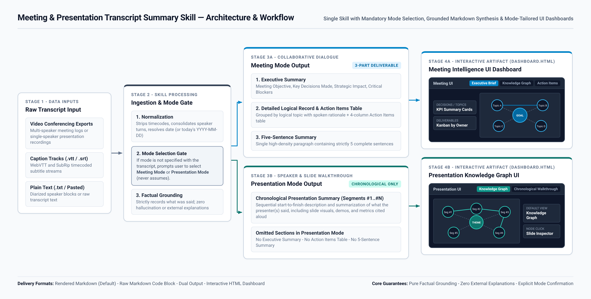
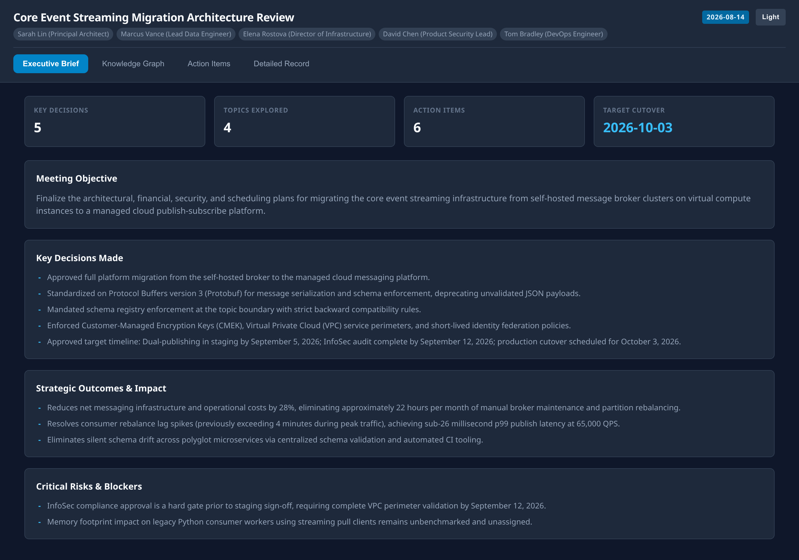
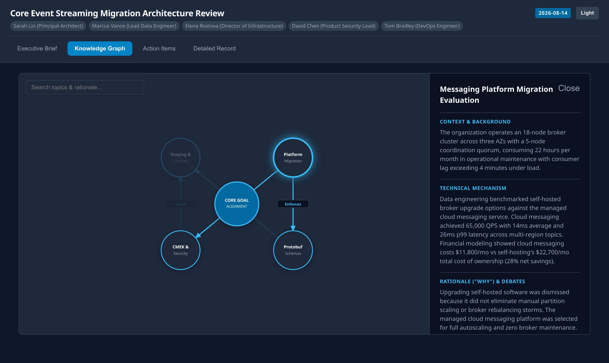
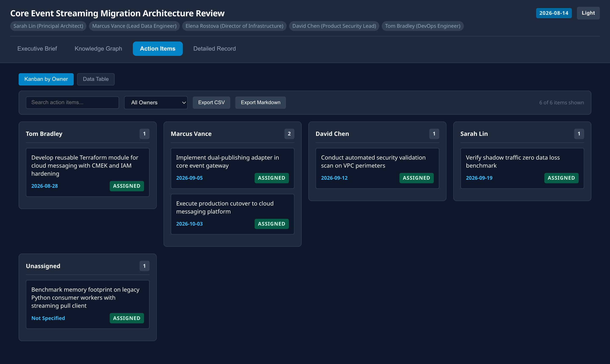
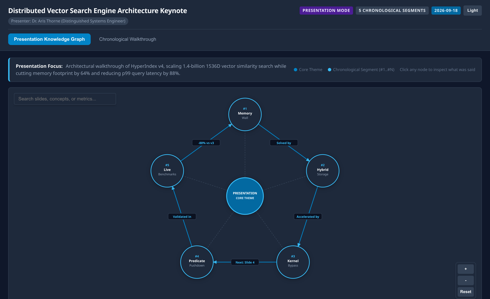

# Meeting and Presentation Transcript Summary Skill

A standardized agent skill for extracting structured, grounded summaries and interactive visual dashboards from raw meeting or presentation transcripts. Compatible with agent platforms, assistant environments, and standalone LLM agent harnesses.

---

## Overview

Generic transcript summaries often reduce spoken content to brief bullet points, losing the technical context, quantitative metrics, and rationale behind decisions. Furthermore, collaborative meetings and single-speaker presentations require distinct summary structures.

This single unified skill (`meeting-transcript-summary`) supports **two selectable processing modes** and **always prompts the user upfront to specify the processing mode (`Meeting Mode` vs. `Presentation Mode`) and whether to create the interactive UI dashboard (`dashboard.html`) upon completion if either is not specified in the request**:

### Mode 1: Meeting Mode (`meeting mode`)
Designed for collaborative meetings with back-and-forth dialogue among participants. Produces a three-part deliverable plus an optional 4-tab Meeting Dashboard:
1. **Executive Summary:** Strategic briefing covering the primary objective, key decisions made, outcomes and impact, and critical blockers stated by participants.
2. **Detailed Discussion Record and Action Items:** A comprehensive narrative record organized by logical topic. Captures the specific details of what was said by participants, statements made, and the rationale (arguments exchanged, trade-offs evaluated, alternatives dismissed) without adding external explanations. Concludes with a four-column Action Items table.
3. **Five-Sentence Summary:** Exactly five complete, self-contained sentences providing a concise briefing of what was said and decided in the meeting.
4. **Interactive Meeting Web Dashboard (when confirmed):** A 4-tab visual interface (`Executive Brief`, `Knowledge Graph`, `Action Items` Kanban/Table, and `Detailed Record`).

### Mode 2: Presentation Mode (`presentation mode`)
Designed for presentations, keynotes, lectures, webinars, or demonstrations where one or more presenters speak sequentially (often walking through slides) without back-and-forth meeting debate.
1. **Chronological Presentation Summary Only:** Outputs the presentation header (`Title`, `Date`, `Presenter(s)`) followed strictly by a numbered, start-to-finish **Chronological Description and Summarization** of what was presented and said (`1. [Segment Title]`, `2. [Segment Title]`, ...).
2. **Strict Omission of Meeting Sections:** Explicitly omits the Executive Summary, Action Items table, and Five-Sentence Summary.
3. **Presentation Knowledge Graph Web Dashboard (when confirmed):** Opens **directly to the Interactive Presentation Knowledge Graph** (visualizing the central presentation theme, chronological progression `#1` through `#N`, conceptual links across slides/segments, and a slide-out Segment Inspector drawer) paired with a `Chronological Walkthrough` timeline tab.

Both modes operate under strict factual grounding rules: zero conversational filler, zero hallucination, and zero external topic explanations.



---

## Repository Structure

```text
meeting-transcript-summary-skill/
├── SKILL.md                                        # Primary agent instruction file supporting Meeting & Presentation modes
├── prd.md                                          # Product Requirements Document (PRD)
├── README.md                                       # End-user documentation and integration guides
├── LICENSE                                         # Apache 2.0 License
├── assets/
│   ├── skill_workflow_diagram.png                  # Architecture and workflow diagram
│   ├── dashboard_executive_brief.png               # Executive Brief screenshot (Meeting Mode)
│   ├── dashboard_knowledge_graph.png               # Topic Knowledge Graph screenshot (Meeting Mode)
│   ├── dashboard_action_items.png                  # Action Items Kanban screenshot (Meeting Mode)
│   └── dashboard_presentation_knowledge_graph.png  # Presentation Knowledge Graph screenshot (Presentation Mode)
├── templates/
│   ├── meeting_dashboard_template.html             # 4-tab interactive dashboard template for Meeting Mode
│   └── presentation_dashboard_template.html        # Knowledge Graph-focused dashboard template for Presentation Mode
├── references/
│   ├── dashboard_ui_guide.md                       # Guide for Meeting & Presentation interactive dashboards and data schemas
│   ├── transcript_formats.md                       # Reference guide for caption and transcript formats
│   └── quality_checklist.md                        # Verification rubric used to audit output quality across both modes
├── examples/
│   ├── sample_meeting_transcript.txt               # Sample meeting transcript (Meeting Mode, synthetic data)
│   ├── sample_output_summary.md                    # Expected three-tier output for Meeting Mode
│   ├── sample_meeting_dashboard.html               # Working interactive dashboard example for Meeting Mode
│   ├── sample_presentation_transcript.txt          # Sample presentation transcript (Presentation Mode, synthetic data)
│   ├── sample_presentation_summary.md              # Expected chronological output for Presentation Mode
│   └── sample_presentation_dashboard.html          # Working Knowledge Graph dashboard example for Presentation Mode
└── scripts/
    └── clean_transcript.py                         # Standalone Python utility to strip caption timestamps
```

---

## Non-Technical User Guide: How to Use This Skill

You do not need any programming experience to use this skill. Follow the steps below to turn a raw recording transcript into a structured summary and optional interactive UI dashboard.

### Step 1: Obtain Your Transcript

Export or copy the text transcript from your video call recording, webinar platform, or transcription tool. The skill accepts:
- Plain text copied and pasted directly into the chat window
- Attached text files (`.txt`)
- Exported subtitle or caption files (`.vtt` or `.srt`)

### Step 2: Provide the Transcript, Choose a Mode, and Specify UI Dashboard Creation

Before generating any output, the assistant requires two settings to be confirmed:
1. **Processing Mode:** `Meeting Mode` or `Presentation Mode`
2. **Interactive UI Dashboard (`dashboard.html`):** Whether the UI dashboard must be created upon completion (`Yes` or `No`)

You can either **paste the transcript first and let the assistant prompt you** for the mode and UI dashboard preference, or **specify both directly in your initial message**.

#### Option A: Paste the Transcript First, Answer the Prompt After (Two-Step Flow)
If you provide a transcript without specifying the mode or whether to create the UI dashboard upon completion, the assistant will not guess. It will pause and ask you for the missing choice(s) before generating output.

**Real-World Example 1 — Weekly Team Planning Call (Pasting Transcript Only, Creating Dashboard):**
1. **You paste into chat:**
   ```text
   Use the meeting-transcript-summary skill on this transcript:

   Sarah Lin (10:01 AM): Let's finalize our Q4 database migration schedule.
   Marcus Vance (10:02 AM): Staging tests completed with zero data loss. I can run the production cutover on October 3.
   Sarah Lin (10:03 AM): Approved. Marcus, please publish the cutover runbook by Friday.
   ```
2. **The assistant asks you:**
   > Before processing this transcript, please specify:
   > 1. **Processing Mode:**
   >    - **Meeting Mode** — 3-part summary (Executive Summary, Detailed Logical Discussion Record with Action Items, and 5-Sentence Summary)
   >    - **Presentation Mode** — Chronological description and summarization of what was said only
   > 2. **Interactive UI Dashboard:** Should the interactive UI dashboard (`dashboard.html`) be created upon completion? (**Yes** / **No**)
3. **You reply:**
   ```text
   meeting mode, yes create the UI dashboard
   ```
   The assistant generates the 3-part meeting summary (Executive Summary, Detailed Discussion Record with the Action Items table, and 5-Sentence Summary) and creates the interactive 4-tab `dashboard.html` artifact upon completion.

**Real-World Example 2 — Recorded Slide Presentation or Webinar (Pasting Transcript First, Summary Only):**
1. **You paste or attach the transcript:**
   ```text
   Apply the meeting-transcript-summary skill to the attached recording transcript.
   ```
2. **The assistant asks you to select the Processing Mode (`Meeting Mode` vs. `Presentation Mode`) and whether to create the interactive UI dashboard (`Yes` vs. `No`).**
3. **You reply:**
   ```text
   presentation mode, no dashboard
   ```
   The assistant generates only the start-to-finish chronological walkthrough of what the presenter said on each slide or section (without an Executive Summary, Action Items table, 5-Sentence Summary, or HTML dashboard).

**Real-World Example 3 — Specifying Mode Only (Assistant Prompts Only for UI Dashboard Preference):**
1. **You write in chat:**
   ```text
   Summarize the attached transcript using the meeting-transcript-summary skill in meeting mode.
   ```
2. **Because the mode was already provided, the assistant asks only the remaining question:**
   > Should the interactive UI dashboard (`dashboard.html`) be created upon completion? (**Yes** / **No**)
3. **You reply:**
   ```text
   Yes
   ```
   The assistant proceeds with Meeting Mode and emits the interactive UI dashboard upon completion.

---

#### Option B: Specify Both Mode and UI Dashboard Preference in Your First Message (One-Step Flow)

If you already know both your preferred mode and whether you want the UI dashboard created upon completion, include both in your initial prompt to run in a single step without follow-up prompts:

- **Example 4 — Meeting Mode + Interactive UI Dashboard Upon Completion:**
  ```text
  Summarize the attached transcript using the meeting-transcript-summary skill in meeting mode and create the UI dashboard upon completion.
  ```
- **Example 5 — Meeting Mode + Markdown Summary Only (No UI Dashboard):**
  ```text
  Summarize the attached transcript using the meeting-transcript-summary skill in meeting mode without creating the UI dashboard.
  ```
- **Example 6 — Presentation Mode + Knowledge Graph UI Dashboard Upon Completion:**
  ```text
  Summarize the following transcript using the meeting-transcript-summary skill in presentation mode and create the UI dashboard upon completion:

  [Paste presentation transcript here]
  ```
- **Example 7 — Presentation Mode + Chronological Summary Only (No UI Dashboard):**
  ```text
  Summarize the attached transcript using the meeting-transcript-summary skill in presentation mode, summary only (no UI dashboard).
  ```
- **Example 8 — Requesting Dual Output (Rendered + Raw Markdown) with Explicit Dashboard Preference:**
  ```text
  Summarize the attached transcript using the meeting-transcript-summary skill in meeting mode with no UI dashboard. Provide dual output with both rendered markdown and a raw markdown code block.
  ```

### Step 3: Use or Share the Output

- **Copying into Word Processors, Docs, or Email:** Highlight and copy the rendered summary directly from the chat window. Headings, bullet lists, and tables retain their formatting when pasted.
- **Copying into Wikis or Markdown Files:** Request `"raw markdown"` or `"dual output"` and click the copy button on the code block.
- **Exploring the Interactive Dashboard:** When you confirm UI dashboard creation, the assistant opens an interactive `dashboard.html` panel upon completion where you can click nodes on the Knowledge Graph, inspect slide or topic details, filter tasks by owner, or toggle between dark and light themes.

---

## Platform Deployment and Integration

### 1. Workspace Skill Integration

To register this skill in a local or shared workspace:

1. Copy the skill directory into your environment's skills path (for example, `.agents/skills/meeting-transcript-summary/` relative to the workspace root).
2. Reference the skill in chat:
   ```text
   Use the meeting-transcript-summary skill in meeting mode and create the UI dashboard upon completion for examples/sample_meeting_transcript.txt
   ```

### 2. Assistant Configuration Interface

To configure this skill in a web-based assistant environment:

1. Open the skills or custom instructions configuration panel.
2. Create a skill named `meeting-transcript-summary`.
3. Copy the contents of [SKILL.md](SKILL.md) into the instruction body.
4. Optionally attach [references/transcript_formats.md](references/transcript_formats.md), [references/dashboard_ui_guide.md](references/dashboard_ui_guide.md), and [references/quality_checklist.md](references/quality_checklist.md) as reference documents.

### 3. Command Line Preprocessing

Use the included Python script to strip WebVTT or SRT timestamps before passing a transcript to an automated workflow:

```bash
# Normalize raw WebVTT or SRT files into consolidated speaker blocks
python3 scripts/clean_transcript.py raw_recording.vtt --output cleaned_transcript.txt

# Pass the cleaned transcript to a CLI agent runner with mode and dashboard preference specified
cat cleaned_transcript.txt | agent-cli --prompt "Execute meeting-transcript-summary in presentation mode with no UI dashboard"
```

---

## Detailed Output Specifications

### Mode 1: Meeting Mode (`meeting mode`)

#### 1. Executive Summary
- **Meeting Objective:** 1 to 2 direct sentences defining the primary purpose of the meeting as stated by participants.
- **Key Decisions Made:** Bulleted list of final agreements and approved proposals.
- **Strategic Outcomes and Impact:** Quantifiable benefits, architectural shifts, or operational impacts mentioned in the transcript.
- **Critical Risks and Blockers:** Unresolved technical, security, or scheduling dependencies.

#### 2. Detailed Discussion Record and Action Items
- **Logical Topic Organization:** Groups dialogue by subject matter rather than chronological order.
- **Details of What Was Said:** Captures specific statements, technical details, configurations, benchmarks, numbers, and constraints spoken by participants without adding external explanations.
- **Points Raised and Rationale:** Documents the arguments exchanged, trade-offs evaluated, and reasons why alternatives were rejected.
- **Action Items Table:** Four aligned columns:
  - `Action Item`: Concrete task description.
  - `Assigned To`: Designated owner name or `Unassigned` if not stated.
  - `Deadline`: Stated date, milestone, or `Not Specified`.
  - `Acceptance Criteria / Target Deliverable`: Specific artifact, sign-off, or outcome required.

#### 3. Five-Sentence Summary
- Exactly 5 complete sentences in a single paragraph summarizing the meeting purpose, core challenge, primary decision, secondary outcome, and immediate next milestone.

---

### Mode 2: Presentation Mode (`presentation mode`)

#### Chronological Presentation Summary
- **Header Metadata:** Presentation Title (`# Presentation Summary: [Title]`), Date (`YYYY-MM-DD`), and `Presenter(s)`.
- **Strict Start-to-Finish Chronological Order:** Segments the transcript into sequential numbered sections (`### 1. [Segment Title]`, `### 2. [Segment Title]`, ...) matching the exact chronological order spoken by the presenter(s).
- **What Was Presented and Said:** Detailed, factual description and summarization of what the presenter(s) said in each segment, including spoken explanations of slide visuals, diagrams, live demonstrations, metrics, benchmarks, and stated takeaways.
- **Omitted Sections:** Does not include an Executive Summary, Action Items table, or Five-Sentence Summary.

---

## Interactive Web Dashboards (Tailored by Mode)

When the user confirms that the interactive UI dashboard must be created upon completion, the skill emits a self-contained HTML/CSS/JavaScript file named `dashboard.html` (`UserFacing: true`, `Summary: "Interactive Evaluation Dashboard"`, `RequestFeedback: false`).

### 1. Meeting Mode Dashboard ([templates/meeting_dashboard_template.html](templates/meeting_dashboard_template.html))
Includes four tabs designed for multi-participant meetings:
- **Executive Overview and Metric Cards:** Displays counts for decisions, topics covered, action items, and target cutover date, followed by cards for Meeting Objective, Key Decisions Made, Strategic Outcomes, and Critical Risks.
  
- **Interactive Topic Knowledge Graph:** SVG node-link topology connecting the core meeting goal to discussed topics with directed relationship edges (`Enforces`, `Requires`, `Gates`) and a slide-out Detail Inspector drawer.
  
- **Action Items Visualizer and Toolbar:** Owner filter dropdown, search input, CSV/Markdown clipboard export, Kanban by Owner board, and data table.
  
- **Detailed Discussion Record:** Expandable topic accordions containing the full narrative record.

### 2. Presentation Mode Dashboard ([templates/presentation_dashboard_template.html](templates/presentation_dashboard_template.html))
Tailored specifically for presentations where the focus is on the conceptual structure and chronological progression rather than meeting action items:
- **Presentation Knowledge Graph (Default Active Tab on Load):**
  - Opens directly to the interactive SVG Knowledge Graph with a top **Presentation Focus** banner.
  - Connects the central `PRESENTATION CORE THEME` node to chronological segment nodes labeled with sequence badges (`#1`, `#2`, `#3`, ...) and concise titles.
  - Displays sequential progression edges (`Next: Slide 4`, `Solved by`) and conceptual links (`Accelerated by`, `Validated in`).
  - Clicking any node opens the **Slide / Segment Detail Inspector Drawer** showing **What Was Presented & Said**, **Slide Visuals, Demos & Metrics Cited**, and **Stated Key Takeaway**.
- **Chronological Walkthrough (Tab 2):**
  - Sequential numbered timeline accordions (`#1` through `#N`) presenting the start-to-finish chronological summary, with Expand/Collapse controls and one-click Markdown export.
- **Omitted Meeting Views:** Does not include Executive Brief metric cards or Action Items tabs.



### Templates and Reference Guides:
- Product Requirements Document: [prd.md](prd.md)
- Meeting Mode Template: [templates/meeting_dashboard_template.html](templates/meeting_dashboard_template.html)
- Presentation Mode Template: [templates/presentation_dashboard_template.html](templates/presentation_dashboard_template.html)
- Working Meeting Dashboard Example: [examples/sample_meeting_dashboard.html](examples/sample_meeting_dashboard.html)
- Working Presentation Dashboard Example: [examples/sample_presentation_dashboard.html](examples/sample_presentation_dashboard.html)
- UI Architecture Guide: [references/dashboard_ui_guide.md](references/dashboard_ui_guide.md)

---

## Core Rules and Constraints

- **Mandatory Mode and UI Dashboard Clarification (Never Assume Defaults):** Before generating output, the agent verifies that both the processing mode (`"meeting mode"` or `"presentation mode"`) and whether to create the interactive UI dashboard (`dashboard.html`) upon completion are specified. If either or both are omitted, the agent prompts the user upfront before processing.
- **Pure Factual Grounding (Zero Hallucination):** Output contains strictly facts, decisions, numbers, slide descriptions, and arguments directly stated in the source transcript.
- **Strictly Record What Was Said (No External Explanations):** Documents exclusively what speakers articulated during the meeting or presentation without adding external definitions or tutorials.
- **Direct Factual Prose:** Eliminates conversational filler phrases, pleasantries, and introductory or closing framing.
- **Zero Extrapolation:** Unstated owners or deadlines in Meeting Mode are recorded explicitly as `Unassigned` or `Not Specified`; unstated transcript dates default to the current date (`YYYY-MM-DD`).

---

## Quality Audit and Examples

Generated outputs are verified against [references/quality_checklist.md](references/quality_checklist.md). Complete synthetic reference inputs, summaries, and interactive dashboards for both modes are available in `examples/`:

### Meeting Mode Examples:
- Input Transcript: [examples/sample_meeting_transcript.txt](examples/sample_meeting_transcript.txt)
- 3-Part Output Summary: [examples/sample_output_summary.md](examples/sample_output_summary.md)
- Interactive Meeting Dashboard: [examples/sample_meeting_dashboard.html](examples/sample_meeting_dashboard.html)

### Presentation Mode Examples:
- Input Presentation Transcript: [examples/sample_presentation_transcript.txt](examples/sample_presentation_transcript.txt)
- Chronological Output Summary: [examples/sample_presentation_summary.md](examples/sample_presentation_summary.md)
- Interactive Presentation Knowledge Graph Dashboard: [examples/sample_presentation_dashboard.html](examples/sample_presentation_dashboard.html)

---

## License

This project is licensed under the Apache License, Version 2.0. See the [LICENSE](LICENSE) file for details.
